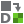

(tutorial-builtin-sg-3d-sphere)=
# Spherical Inclusion Microstructure (3D SG)


## 3D SG preparation

In this example, use the following material properties:
- Fiber: Young’s modulus $E$=379.3 GPa, Poisson’s ratio $\nu$=0.1
- Matrix: Young’s modulus $E$=68.3 GPa, Poisson’s ratio $\nu$=0.3
- Interphase: $E_1$=117.0 GPa, $E_2$=$E_3$=8.54 GPa, $\nu_{12}$=$\nu_{13}$=0.278, $\nu_{23}$=0.5, $G_{12}$=$G_{13}$=3.9 GPa, $G_{23}$=2.83 GPa.

Then click the 3D common SG button  then the dialog box will pop out (Fig. 2.3-3).
This 3D SG has length 1.0 in every dimension.
Set the **Geometry** > **Inclusion** > **Volume fraction** to 0.4.
Set the **Geometry** > **Interphace** > **Volume fraction** to 0.1.

```{figure} /_static/images/sg-3d-db-spherical-inclusion.png
:align: center

Create 3D SG dialog box.
```

After setting all the parameters as shown in Fig. 2.3-3, click **OK** to create the SG (Fig. 2.3-4).

```{figure} /_static/images/sg-3d-sph-geo-visual.png
:align: center

Fig. 2.3-4 The created 3D SG
```

## Homogenization

Click the **homogenization** button  then the dialog box will pop up.
In this example, we choose the 3D solid macro model, then the default file name will be `inclusionP3_nSG3_3D_C3D4.sc`.
Click **OK** and wait for preparing the input file of SwiftComp and homogenization.
After the computation of SwiftComp, the effective properties will pop up automatically (Fig. 2.3-6).

```{figure} /_static/images/sg-3d-sph-solid-homog-db.png
:align: center

Homogenization dialog box-use 3D solid model.
```
```{figure} /_static/images/sg-3d-sph-solid-homog-output.png
:align: center

Effective properties of 3D solid model.
```

## Dehomogenization

Click the **dehomogenization** button  then the dialog box will pop out.
Choose **SG Model Source** > **CAE** and select the model "inclusionP3_nSG3_3D_C3D4".
Input **Macroscopic analysis results** as shown in Fig. 2.3-8.

```{figure} /_static/images/sg-3d-sph-solid-dehomog-cae.png
:align: center

Dehomogenization parameters for 3D solid model.
```

Click **OK** and wait for SwiftComp to finish the computation.
Switch to the **Visualization** module, the user is able to view all the field results.
In the odb tree, three sections are created, with each section containing the same material properties.

```{figure} /_static/images/sg-3d-sph-solid-dehomog-visual.png
:align: center

Dehomogenization results of 3D model.
```
